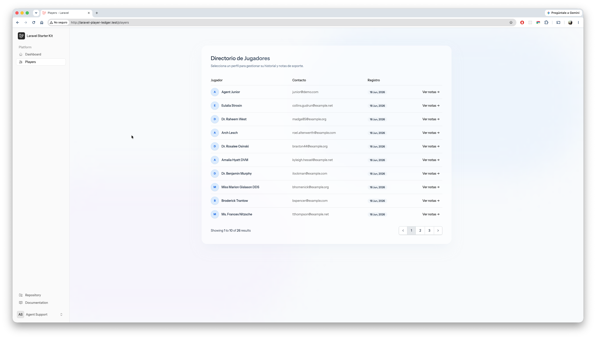
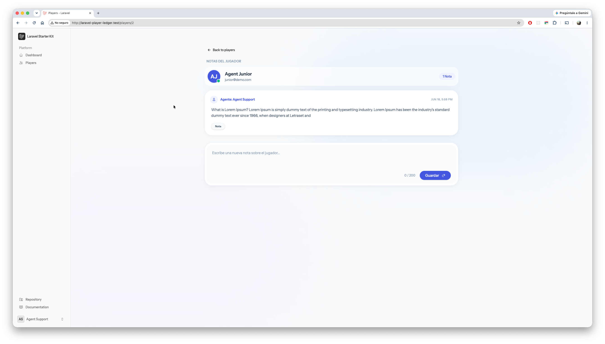

# Player Ledger & Support Notes

Este es un módulo de gestión de notas para perfiles de jugadores. Lo desarrollé como prueba técnica para demostrar cómo estructuro una aplicación moderna usando **Laravel 13, Livewire 4 y Pest**, aplicando principios de arquitectura limpia (Patrón Repositorio y DTOs).

La idea principal es que los agentes de soporte puedan dejar notas en los perfiles de los usuarios, con una interfaz que se actualiza en tiempo real sin recargar la página.

### Vista General del Módulo

| Directorio de Jugadores | Historial y Notas del Perfil |
| :---: | :---: |
|  |  |

---

## Cómo abordé los requerimientos

En lugar de hacer un CRUD básico, quise darle una estructura escalable. Así es como resolví cada punto:

### 1. Base de Datos y Modelos
* **Migraciones y Relaciones:** Creé la tabla `player_notes` con sus respectivas llaves foráneas. En los modelos de Eloquent, dejé configuradas las relaciones (`PlayerNote` pertenece a un `Player` y a un `User` que actúa como autor).
* **Auditoría transparente:** Para no ensuciar los controladores asignando el autor manualmente en cada nota, agregué un Trait (`RecordSignature`) que se encarga de registrar el ID del agente de forma automática.

### 2. Capa de Lógica (Repositorio y DTOs)
* **Desacoplamiento:** Para separar la lógica de negocio de la base de datos, implementé `PlayerNoteRepositoryInterface` y su respectiva clase `EloquentPlayerNoteRepository`. Todo esto está inyectado a través del `RepositoryServiceProvider`.
* **Data Transfer Objects (DTO):** Toda la data que entra para crear una nota pasa por `CreatePlayerNoteDTO`. Es una clase *readonly* que me garantiza un tipado estricto antes de tocar la capa de persistencia.

### 3. Frontend (Livewire & Flux UI)
* **Reactividad:** El componente principal lista las notas y maneja un formulario interactivo. Al guardar una nota, emito el evento `note-saved`. Esto actualiza la lista, dispara un Toast de éxito y hace que el componente `PlayerNoteCount` actualice su contador automáticamente.
* **Validación limpia:** Usé un Form Object (`PlayerNoteForm`) para mantener las reglas de validación (`required`, `string`, `max:200`) fuera del componente principal.
* **Control de Accesos:** Protegí el formulario en la vista usando la directiva `@can('add-player-note')`. Por detrás, esto se conecta con `Spatie Permission` para verificar si el usuario logueado realmente tiene permisos para ejecutar la acción.

### 4. Calidad de Código
Aproveché las características de PHP moderno a lo largo de todo el código: tipado estricto tanto en parámetros como en retornos, clases de solo lectura (*readonly*) y *constructor property promotion* para mantener las clases limpias y fáciles de leer.

### 5. Pruebas Automatizadas (Testing)
Escribí una suite de pruebas usando **Pest** (`tests/Feature/PlayerNoteTest.php`) para asegurar que la lógica principal no se rompa:
* Verifico el *happy path*: un agente con los permisos correctos puede guardar una nota y esta se refleja en la base de datos.
* Pruebo que la validación ataje correctamente los intentos de guardar notas vacías o que excedan el límite de 200 caracteres.

---

## Instalación y Setup

Para levantar el proyecto en tu entorno local, sigue estos pasos:

### Prerrequisitos
- PHP 8.4
- Composer
- Node.js (v18 o superior) y npm

### Pasos para levantar el proyecto

1. **Clona el repositorio**:
   ```bash
   git clone https://github.com/Carranza32/laravel-player-ledger.git
   cd laravel-player-ledger
   ```

2. **Instalar dependencias**:
   Ejecuta el siguiente comando para instalar todas las dependencias de PHP y Node.js:
   ```
   composer install && npm install
   ```

3. **Configurar Base de Datos**:
   Revisa tu .env y ejecuta las migraciones con los seeders para poblar la base de datos con roles y usuarios de prueba:
   ```bash
   php artisan migrate:fresh --seed
   ```

4. **Ejecutar servidor Laravel y compilar assets**:

   ```bash
   php artisan serve
   npm run dev
   ```
   Abre tu navegador en [http://localhost:8000](http://localhost:8000).

---

## Credenciales de Prueba (Demo Users)

El seeder del proyecto crea dos cuentas de agente de soporte con la contraseña predeterminada `password`:

1. **Agente con Permisos (Rol: support-agent)**
   - **Email**: `agent@demo.com`
   - **Password**: `password`
   - *(Este usuario puede visualizar el perfil del jugador, ver las notas y agregar nuevas notas).*

2. **Agente sin Permisos (Junior / Sin Rol)**
   - **Email**: `junior@demo.com`
   - **Password**: `password`
   - *(Este usuario puede visualizar el perfil y las notas, pero el botón y el formulario para "Agregar Nota" no serán visibles debido al control de permisos).*

---

## Ejecutar la Suite de Pruebas

Para validar el backend y lógica de negocio, ejecuta Pest PHP:

```bash
# Correr las pruebas
php artisan test --filter=PlayerNoteTest
```
